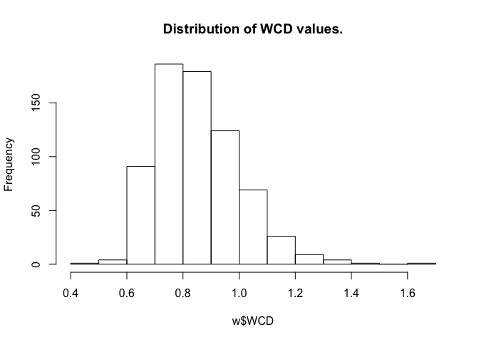

<!-- README.md is generated from README.Rmd. Please edit that file -->

# calcWCD v.1.0.2

calcWCD calculates weighted copublication distance between a
gene/protein and a disease/term in PubMed literature.

## Installation

The released version of calcWCD can be installed from this repo
directly:

``` r
devtools::install_github("ed-lau/calcWCD")
```

## Updates

2023-07-15 v.1.0.1 Due to 2023 changes to the NCBI EUtils API limiting
PubMed retrieval to 9999 items, calcWCD now uses the EuropePMC API to
retrieve PMIDs. A new `max_retrieval` argument is added to `pmid()` to
limit the number of retrievals.

## Example

A basic example using test PMID and Annotation data included in the
package:

``` r
require(calcWCD)
w <- wcd(pmids = test_pmids, annot = test_annotation)

w
#> # A tibble: 695 × 8
#>    GeneID Term_count Total_count WCD_n WCD_d   WCD     Z       P
#>     <int>      <dbl>       <dbl> <dbl> <dbl> <dbl> <dbl>   <dbl>
#>  1   5972     231.        487.    1.13  2.55 0.446 -2.74 0.00305
#>  2   1636     160.        467.    1.29  2.56 0.504 -2.35 0.00940
#>  3    183     146.        421.    1.33  2.61 0.511 -2.30 0.0106 
#>  4   8991      76.4       141.    1.61  3.09 0.523 -2.22 0.0131 
#>  5  59272      20.2        36.7   2.19  3.67 0.597 -1.73 0.0420 
#>  6   1628      37.2       106.    1.93  3.21 0.601 -1.71 0.0440 
#>  7    659      17.2        36.2   2.26  3.68 0.615 -1.61 0.0541 
#>  8    185      38.3       135.    1.91  3.11 0.616 -1.60 0.0549 
#>  9  65266       4.37        4.37  2.86  4.59 0.622 -1.56 0.0591 
#> 10   1906      51.2       232.    1.79  2.87 0.623 -1.55 0.0603 
#> # … with 685 more rows
```

Distribution of WCD values in the test files:



## Reference

Edward Lau, Vidya Venkatraman, Cody T Thomas, Jennifer E Van Eyk, Maggie
P. Y. Lam. Identifying high-priority proteins across the human diseasome
using semantic similarity. bioRxiv 309203; doi:
<https://doi.org/10.1101/309203>
